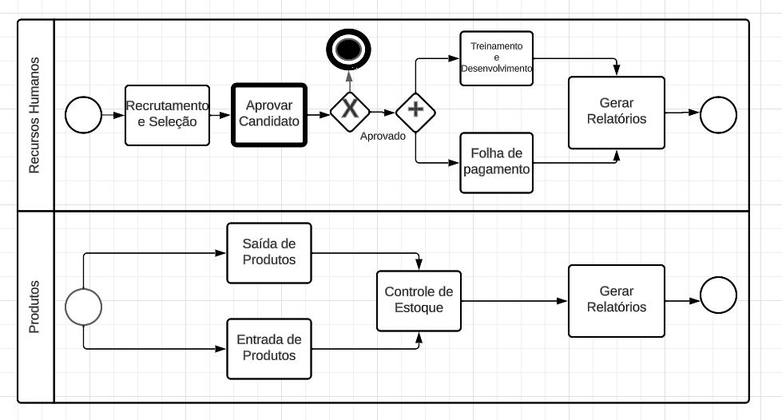

# Especificações do Projeto

Nesta seção abordaremos a especificação do projeto, focando na resolução do problema identificado por meio da perspectiva do usuário. Para alcançar esse objetivo, utilizaremos uma série de técnicas e ferramentas que nos ajudarão a definir claramente as necessidades, expectativas e requisitos do público-alvo. A seguir, enumeramos os principais pontos que serão abordados nesta seção:

Diagrama de Personas:
Apresentaremos as personas que nos ajudará a visualizar as características, necessidades e expectativas dos usuários de forma mais tangível.

Histórias de Usuários:
Listaremos cenários e situações em que os usuários interagem com a solução. Isso nos permitirá entender como eles usarão a ferramenta em situações reais e quais objetivos esperam alcançar.

Requisitos Funcionais e Não Funcionais:
Especificaremos os recursos e funcionalidades que a solução deve incluir para atender às necessidades dos usuários. Além disso, abordaremos requisitos não funcionais, como desempenho, segurança e usabilidade.

Restrições do Projeto:
Identificaremos quaisquer limitações técnicas, financeiras ou de tempo que possam impactar o desenvolvimento da solução. Isso nos ajudará a definir um escopo realista para o projeto.

Ao abordar cada um desses pontos de maneira abrangente e organizada, nossa especificação do projeto se tornará uma base sólida para o desenvolvimento da solução, garantindo que as necessidades dos usuários sejam atendidas de forma eficaz e satisfatória.

///

Definição do problema e ideia de solução a partir da perspectiva do usuário. É composta pela definição do  diagrama de personas, histórias de usuários, requisitos funcionais e não funcionais além das restrições do projeto.

Apresente uma visão geral do que será abordado nesta parte do documento, enumerando as técnicas e/ou ferramentas utilizadas para realizar a especificações do projeto

## Personas

<table>
 <tbody>
  <tr>
   <td rowspan="3"></td>
   <td colspan="3"><strong> Kellen Araújo</strong></td>
  </tr>
  
  <tr>
   <td>33 Anos</td>
   <td>Timóteo/MG </td>
   <td>Empreendedora</td>
  </tr>
  
  <tr>
   <td colspan="3">
    <strong>Personalidade</strong>: Prestativa, detalhista e dedicada
   </td>
  </tr>
  
  <tr>
   <td colspan="4">
    <strong>Biografia</strong>: Não teve oportunidade de cursar uma faculdade e depois de alguns empregos com carteira assinada sem nenhuma previsão de crescimento dentro das empresas, decidiu abrir uma loja de artesanatos para ter uma renda maior do que tinha nos seus antigos empregos. Como é nova na administração de uma empresa, busca toda ajuda que encontra para que sua empresa prospere.
   </td>
  </tr>
  
  <tr>
   <td colspan="4">
    <strong>Objetivos</strong>:  Ter uma aplicação onde ela possa ver com mais detalhe o seu faturamento e seus gastos para saber como anda a saúde financeira da sua empresa.
   </td>
  </tr>
  
  <tr>
   <td colspan="4">
    <strong>Pontos de dor e frustração</strong>: Como sua empresa ainda não tem faturamento alto, ainda não consegue ter um setor contábil a disposição onde ela possa sempre verificar como a empresa está indo financeiramente.
   </td>
  </tr>
  
  <tr>
   <td colspan="4">
    <strong>Necessidades e expectativas</strong>: Encontrar uma aplicação que a dê um panorama financeiro geral da sua empresa.
   </td>
  </tr>
 </body>
<table>

 <table>
 <tbody>
  <tr>
   <td rowspan="3"></td>
   <td colspan="3"><strong>Marina Costa</strong></td>
  </tr>

  <tr>
   <td>28 Anos</td>
   <td>Belo Horizonte</td>
   <td>Administradora</td>
  </tr>

  <tr>
   <td colspan="3">
    <strong>Personalidade</strong>: Marina é uma pessoa determinada e comprometida. Ela é meticulosa em seus processos de trabalho e valoriza a precisão e a organização. Sua abordagem é orientada para resultados, e ela gosta de enfrentar desafios complexos. Marina também é uma líder inspiradora, motivando sua equipe a alcançar seus melhores desempenhos.
   </td>
  </tr>

  <tr>
   <td colspan="4">
    <strong>Biografia</strong>: Marina é uma administradora dedicada com pouco mais de 2 anos de experiência em gerenciamento financeiro. Ela começou sua carreira como estagiária em uma pequena empresa e rapidamente progrediu para posições de liderança devido à sua habilidade de tomar decisões estratégicas e sua atenção aos detalhes. 
   </td>
  </tr>

  <tr>
   <td colspan="4">
    <strong>Objetivos</strong>: Marina é apaixonada por garantir que as finanças de sua empresa estejam em ordem e que os recursos sejam alocados de forma eficiente. Seu objetivo é melhorar os processos financeiros da empresa, reduzir custos desnecessários, aumentar a lucratividade e garantir o cumprimento de todas as obrigações fiscais e regulatórias.
   </td>
  </tr>

  <tr>
   <td colspan="4">
    <strong>Pontos de dor e frustração</strong>: Marina frequentemente se depara com dificuldades em consolidar informações financeiras de várias fontes. Ela precisa lidar manualmente com planilhas e relatórios dispersos, o que consome muito tempo e deixa margem para erros. Além disso, ela enfrenta problemas para visualizar de forma clara e rápida a saúde financeira atual da empresa, o que dificulta a tomada de decisões estratégicas.
   </td>
  </tr>

  <tr>
   <td colspan="4">
    <strong>Necessidades e expectativas</strong>: Marina está buscando um software de gerenciamento financeiro que possa integrar dados de diversas áreas, como contabilidade, folha de pagamento e vendas. Ela espera que o software seja intuitivo e fácil de usar, mesmo para os membros de sua equipe que não são especialistas em finanças. Além disso, ela espera que o software ofereça relatórios personalizáveis e análises em tempo real, para que ela possa tomar decisões informadas de maneira mais ágil.
   </td>
  </tr>
 </body>
<table>

<table>
 <tbody>
  <tr>
   <td rowspan="3"></td>
   <td colspan="3"><strong> Philippe Alves</strong></td>
  </tr>
  <tr>
   <td>25 Anos</td>
   <td>São Paulo/SP </td>
   <td>Desenvolvedor de Software</td>
  </tr>
  <tr>
   <td colspan="3">
    <strong>Personalidade</strong>: Criativo, focado e apaixonado por tecnologia
   </td>
  </tr>
  <tr>
   <td colspan="4">
    <strong>Biografia</strong>: Formado em Ciência da Computação, Philippe é um desenvolvedor de software talentoso e apaixonado por programação desde criança. Ele é CEO de uma startup de tecnologia, onde ajuda a criar aplicativos inovadores.
   </td>
  </tr>
  <tr>
   <td colspan="4">
    <strong>Objetivos</strong>: Desenvolver aplicativos e soluções tecnológicas que melhorem a vida das pessoas e impulsionem o crescimento da sua startup.
   </td>
  </tr>
  <tr>
   <td colspan="4">
    <strong>Pontos de dor e frustração</strong>: Enfrenta dificuldades em lidar com a comlexidade na parte da contabilidade da empresa.
   </td>
  </tr>
  <tr>
   <td colspan="4">
    <strong>Necessidades e expectativas</strong>: Descomplicar a contabilidade da startup para que possam focar mais no desenvolvimento de software.
   </td>
  </tr>
 </body>
<table>

   

## Histórias de Usuários

Com base na análise das personas forma identificadas as seguintes histórias de usuários:

|EU COMO... `PERSONA`| QUERO/PRECISO ... `FUNCIONALIDADE` |PARA ... `MOTIVO/VALOR`                 |
|--------------------|------------------------------------|----------------------------------------|
|Kellen Araújo  | Inserir a quantidade vendida de cada produto           | Saber quanto foi o retorno financeiro de cada protudo a venda  |
|Kellen Araújo       | Fazer uma compraração com as vendas com diferentes meses    | Verificar quais meses a venda são maiores e quais são as menores |
|Marina Costa    | Entender rapidamente como está a saúde financeira da empresa.  |  Tomar decisões informadas sobre compras de matéria-prima e investimentos. |
|Marina Costa    |  Ter uma visão clara das despesas mensais da empresa.   |   Planejar o orçamento de forma eficaz e garantir que as despesas estejam sob controle. |
|Philippe Alves    |  Visão Geral das Finanças  |  Ter uma visão clara e simplificada das finanças da startup para tomar decisões rápidas. |
|Philippe Alves    |  Comparação de Desempenho Mensal  |  Comparar o desempenho financeiro de diferentes meses e entender como anda a sua startup. |

## Modelagem do Processo de Negócio 

### Análise da Situação Atual

Na situação atual, pequenas empresas no Brasil enfrentam desafios significativos em relação à gestão financeira. Muitas delas ainda dependem de métodos manuais ou planilhas desatualizadas para acompanhar suas finanças, resultando em erros e falta de visibilidade em tempo real. A ausência de uma plataforma centralizada dificulta o acesso rápido a informações financeiras importantes, o que prejudica a avaliação do desempenho financeiro e a tomada de decisões corretivas.

### Descrição Geral da Proposta

Propomos desenvolver uma aplicação de gestão financeira personalizada para atender às necessidades específicas de uma empresa. Esta aplicação facilitará o monitoramento do estado da empresa e facilitará o controle das finanças. Além disso, a aplicação estará acessível através de dispositivos móveis e desktops, permitindo que os usuários acessem suas informações financeiras de qualquer lugar, a qualquer momento. A interface será projetada com foco na usabilidade, sendo intuitiva e fácil de usar, mesmo para aqueles sem experiência financeira.

### Processo 1 – MODELAGEM AS IS

O AS-IS é a situação atual dos processos, ou seja, como os processos funcionam hoje. Pode-se melhorar com a criação do controle financeiro mais detalhado da empresa.

### Processo 2 – MODELAGEM TO BE 

O TO-BE é o processo futuro, ou seja, ele é o processo melhorado, aquele processo que queremos que a empresa venha a seguir. Ele é o processo onde as melhorias estão sendo implementadas.

## Indicadores de Desempenho

Apresente aqui os principais indicadores de desempenho e algumas metas para o processo. Atenção: as informações necessárias para gerar os indicadores devem estar contempladas no diagrama de classe. Colocar no mínimo 5 indicadores. 

| Indicador | Objetivos | Descrição | Cálculo | Fonte de dados | Perspectiva|
| ------------ |------------- |-------------- |----------- |--------------------- |--------------- |
| Estoque Mínimo | Não ficar sem estoque | Mede o ponto de pedido dos produtos | | Tabela Quantidade de produto | Setor de Estoque |
| Total Custo Fixo | Preparar a empresa para os gastos futuros | Mede os valores que a empresa possui todos os meses | | Tabela Custo Fixo | Gestor |
| Comparativo Custo Variável mensal | Projetar uma possibilidade de gastos futuros | Informa uma tendencia de quanto vai ser o gasto desses custos | | Tabela Custo Variável | Gestor |
| Gasto com pessoal | Verificar o valor gasto com funcionários | Mostrar a soma do salário e os benefícios dos funcionários | | Tabela RH | Gestor | 
| Relatório geral mensal | Verifica a saúde financeira da empresa | Mostra o lucro ou prejuízo da empresa ao longo dos meses |  | Tabela DRE | Gestor |

Obs.: todas as informações para gerar os indicadores devem estar no diagrama de classe a ser apresentado a posteriori. 

## Requisitos

As tabelas que se seguem apresentam os requisitos funcionais e não funcionais que detalham o escopo do projeto. Para determinar a prioridade de requisitos, aplicar uma técnica de priorização de requisitos e detalhar como a técnica foi aplicada.

### Requisitos Funcionais

|ID&nbsp;&nbsp;&nbsp;&nbsp;&nbsp;&nbsp;&nbsp;&nbsp;&nbsp;&nbsp;    | Descrição do Requisito  | Prioridade |
|-------|-----------------------------------------|----|
|RF-01  | A aplicação deve permitir o usuário acessar sua conta. | Alta | 
|RF-02  | A aplicação deve permitir o usuário cadastrar novos dados.| Alta |
|RF-03  | A aplicação deve permitir o usuário realizar alterações nos dados cadastrados/preenchidos.| Alta |
|RF-04  | A aplicação deve permitir o usuário excluir dados das tabelas. | Alta |
|RF-04  | A aplicação deve permitir o usuário o acesso aos dados fornecidos anteriormente.| Alta |
|RF-05  | A aplicação deve permitir o usuário visualizar comparações feitas apartir de dados cadastrados.| Alta |
|RF-06  | A aplicação deve trazer os valores do mês anterior de cada item no módulo Custos Fixos. | Alta |
|RF-07  | A aplicação deve deixar os campos de valores em branco para o início de cada mês no módulo Custos Variáveis. | Alta |
|RF-08  | A aplicação deve calcular o custo mensal dos empregados, levando em consideração todos os itens que estão descritos no seu cadastro. | Alta |
|RF-09  | A aplicação deve calcular a quantidade a ser comprada com os dados inseridos em cada produto no módulo Estoque. | Alta |
|RF-10  | A aplicação deve calcular o faturamento mensal com base nas vendas dos produtos inseridos no módulo Estoque. | Alta |
|RF-11  | A aplicação deve possuir um buscador de produto no módulo Estoque | Média |
|RF-12  | A aplicação deve possuir filtro de categoria nos módulos de Custos Fixos e Variáveis | Médio |
|RF-13  | A aplicação deve gerar gráficos comparativo dos itens nos módulos de Custo Fixos e Variáveis | Médio |
|RF-14  | A aplicação deve gerar gráfico em pizza demostrando os gastos totais de cada módulo | Médio |
|RF-15  | A aplicação deve possuir filtros para separa/organizar as categorias no módulo RH | Baixa |
|RF-16  | A aplicação deve gerar gráficos comparando as vendas dos produtos no módulo Estoque | Baixa |
|RF-17  | A aplicação deve gerar gráficos comparando cargo e salários no módulo RH | Baixa |

### Requisitos não Funcionais

|ID&nbsp;&nbsp;&nbsp;&nbsp;&nbsp;&nbsp;&nbsp;&nbsp;&nbsp;&nbsp;         | Descrição do Requisito  |Prioridade |
|--------|-------------------------|----|
|RNF-01  | A aplicação deve ser acompanhada por uma documentação completa e atualizada que descreva todos os endpoints, parâmetros de solicitação, tipos de resposta e exemplos de uso. | Alta | 
|RNF-02  | A aplicação deve registrar eventos importantes, erros e atividades críticas para fins de auditoria, solução de problemas e segurança.| Alta | 
|RNF-03  | A documentação deve ser de fácil compreensão e acessível para desenvolvedores que desejam integrar a API, incluindo guias de início rápido e exemplos de código. | Alta |
|RNF-04  | A aplicação deve implementar autenticação baseada em tokens JWT (JSON Web Tokens) e autorização baseada em funções para garantir que apenas usuários autorizados tenham acesso a recursos específicos. | Média |
|RNF-05  | A API deve estar disponível para uso 24/7, com um tempo de atividade mínimo de 99,9% do tempo. |  Média | 

Com base nas Histórias de Usuário, enumere os requisitos da sua solução. Classifique esses requisitos em dois grupos:

- [Requisitos Funcionais
 (RF)](https://pt.wikipedia.org/wiki/Requisito_funcional):
 correspondem a uma funcionalidade que deve estar presente na
  plataforma (ex: cadastro de usuário).
- [Requisitos Não Funcionais
  (RNF)](https://pt.wikipedia.org/wiki/Requisito_n%C3%A3o_funcional):
  correspondem a uma característica técnica, seja de usabilidade,
  desempenho, confiabilidade, segurança ou outro (ex: suporte a
  dispositivos iOS e Android).
Lembre-se que cada requisito deve corresponder à uma e somente uma
característica alvo da sua solução. Além disso, certifique-se de que
todos os aspectos capturados nas Histórias de Usuário foram cobertos.

## Restrições

O projeto está restrito pelos itens apresentados na tabela a seguir.

|ID| Restrição                                             |
|--|-------------------------------------------------------|
|01| A equipe de desenvolvimento disponível para o projeto é limitada a um número específico de membros e não pode ser aumentada. |
|02| O projeto deve ser desenvolvido utilizando tecnologias específicas já em uso na organização, sem a introdução de novas tecnologias. |
|03| Deve ser seguido um conjunto rigoroso de políticas de segurança que impõe restrições sobre o armazenamento, acesso e proteção dos dados do projeto.|
|04| O projeto não pode ser desenvolvido por terceiros que não fazem parte da equipe de desenvolvedores.|
|05| As tecnologias ou software utilizados no projeto devem estar em conformidade com licenças específicas (por exemplo, licenças de código aberto) e não podem infringir direitos autorais ou licenças.|

Enumere as restrições à sua solução. Lembre-se de que as restrições geralmente limitam a solução candidata.

> **Links Úteis**:
> - [O que são Requisitos Funcionais e Requisitos Não Funcionais?](https://codificar.com.br/requisitos-funcionais-nao-funcionais/)
> - [O que são requisitos funcionais e requisitos não funcionais?](https://analisederequisitos.com.br/requisitos-funcionais-e-requisitos-nao-funcionais-o-que-sao/)

## Diagrama de Casos de Uso

O diagrama de casos de uso é o próximo passo após a elicitação de requisitos, que utiliza um modelo gráfico e uma tabela com as descrições sucintas dos casos de uso e dos atores. Ele contempla a fronteira do sistema e o detalhamento dos requisitos funcionais com a indicação dos atores, casos de uso e seus relacionamentos. 

As referências abaixo irão auxiliá-lo na geração do artefato “Diagrama de Casos de Uso”.

> **Links Úteis**:
> - [Criando Casos de Uso](https://www.ibm.com/docs/pt-br/elm/6.0?topic=requirements-creating-use-cases)
> - [Como Criar Diagrama de Caso de Uso: Tutorial Passo a Passo](https://gitmind.com/pt/fazer-diagrama-de-caso-uso.html/)
> - [Lucidchart](https://www.lucidchart.com/)
> - [Astah](https://astah.net/)
> - [Diagrams](https://app.diagrams.net/)

# Matriz de Rastreabilidade

A matriz de rastreabilidade é uma ferramenta usada para facilitar a visualização dos relacionamento entre requisitos e outros artefatos ou objetos, permitindo a rastreabilidade entre os requisitos e os objetivos de negócio. 

A matriz deve contemplar todos os elementos relevantes que fazem parte do sistema, conforme a figura meramente ilustrativa apresentada a seguir.

# Gerenciamento de Projeto

De acordo com o PMBoK v6 as dez áreas que constituem os pilares para gerenciar projetos, e que caracterizam a multidisciplinaridade envolvida, são: Integração, Escopo, Cronograma (Tempo), Custos, Qualidade, Recursos, Comunicações, Riscos, Aquisições, Partes Interessadas. Para desenvolver projetos um profissional deve se preocupar em gerenciar todas essas dez áreas. Elas se complementam e se relacionam, de tal forma que não se deve apenas examinar uma área de forma estanque. É preciso considerar, por exemplo, que as áreas de Escopo, Cronograma e Custos estão muito relacionadas. Assim, se eu amplio o escopo de um projeto eu posso afetar seu cronograma e seus custos.

## Gerenciamento de Tempo

O gerente de projetos pode utilizar desse recurso para agendar e coordenar tarefas dentro de um projeto fazendo a estimativa de tempo necessário para a conclusão.

## Gerenciamento de Equipe

O gerenciamento adequado de tarefas contribuirá para que o projeto alcance altos níveis de produtividade. Por isso, é fundamental que ocorra a gestão de tarefas e de pessoas, de modo que os times envolvidos no projeto possam ser facilmente gerenciados. 

## Gestão de Orçamento

O processo de determinar o orçamento do projeto é uma tarefa que depende, além dos produtos (saídas) dos processos anteriores do gerenciamento de custos, também de produtos oferecidos por outros processos de gerenciamento, como o escopo e o tempo.

