# Projeto de Interface

Pré-requisitos: <a href="2-Especificação do Projeto.md"> Documentação de Especificação</a>

Visão geral da interação do usuário pelas telas do sistema e protótipo interativo das telas com as funcionalidades que fazem parte do sistema (wireframes).

 Apresente as principais interfaces da plataforma. Discuta como ela foi elaborada de forma a atender os requisitos funcionais, não funcionais e histórias de usuário abordados nas <a href="2-Especificação do Projeto.md"> Documentação de Especificação</a>.

## Diagrama de Fluxo

O diagrama apresenta o estudo do fluxo de interação do usuário com o sistema interativo e  muitas vezes sem a necessidade do desenho do design das telas da interface. Isso permite que o design das interações seja bem planejado e gere impacto na qualidade no design do wireframe interativo que será desenvolvido logo em seguida.

As referências abaixo irão auxiliá-lo na geração do artefato “Diagramas de Fluxo”.

> **Links Úteis**:
> - [Fluxograma online: seis sites para fazer gráfico sem instalar nada | Produtividade | TechTudo](https://www.techtudo.com.br/listas/2019/03/fluxograma-online-seis-sites-para-fazer-grafico-sem-instalar-nada.ghtml)

## Wireframes

Abaixo serão apresentados os modelos wireframes do projeto nas seguintes divisões: Login/Home, Recursos Humanos, Despesas e Estoque.

1 - Na imagem a seguir, será ilustrado as passagens de tela do Login e o acesso à aplicação(página Home):

2 - A seguir será ilustrado a tela de Recursos Humanos e seus fluxos:

  2.1 - Fluxo de tela de adição de um novo funcionário:

  

  2.2 - Fluxo de tela de edição dos dados de um funcionário:

  

  2.3 - Fluxo de tela de remoção de um funcionário:

  

3 - Abaixo será ilustrado a tela de Despesas e seus fluxos:

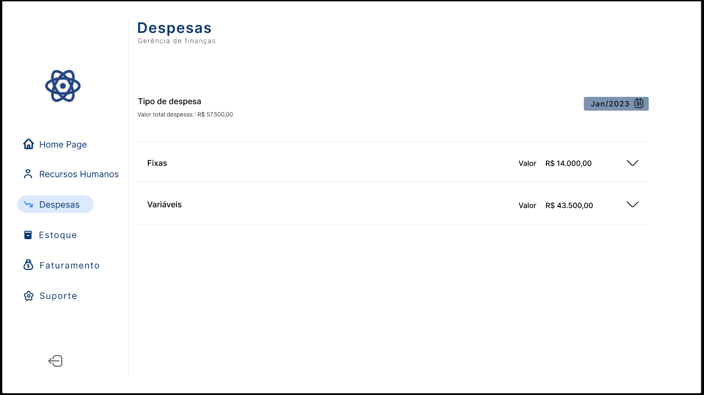

  3.1 - Fluxo de tela de adição de uma nova despesa fixa:

  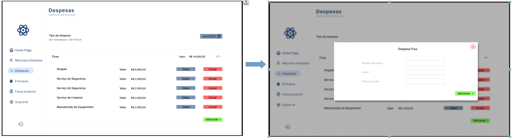

  3.2 - Fluxo de tela de edição de uma despesa fixa:

  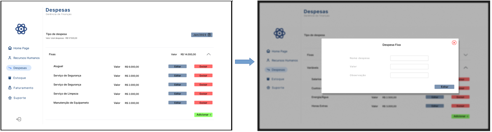

  3.3 - Fluxo de tela de remoção de uma despesa fixa:

  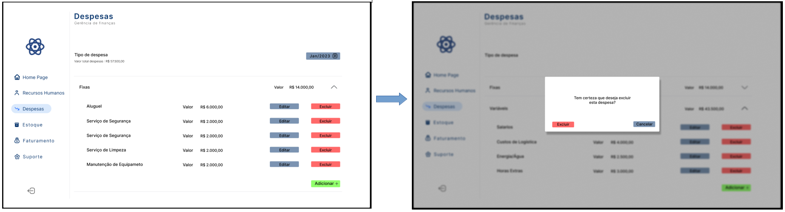
  
  3.4 - Fluxo de tela de adição de uma nova despesa variável:

  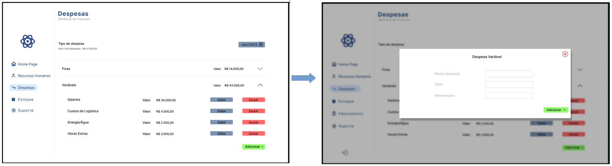

  3.5 - Fluxo de tela de edição de uma despesa variavel:

  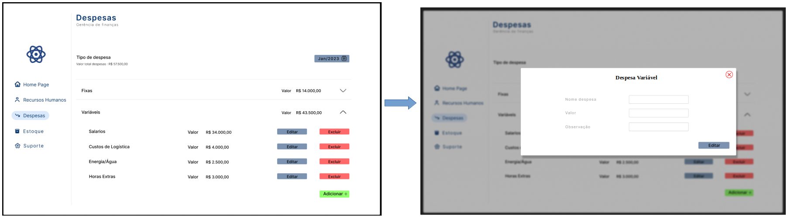

  3.6 - Fluxo de tela de remoção de uma despesa variável:

  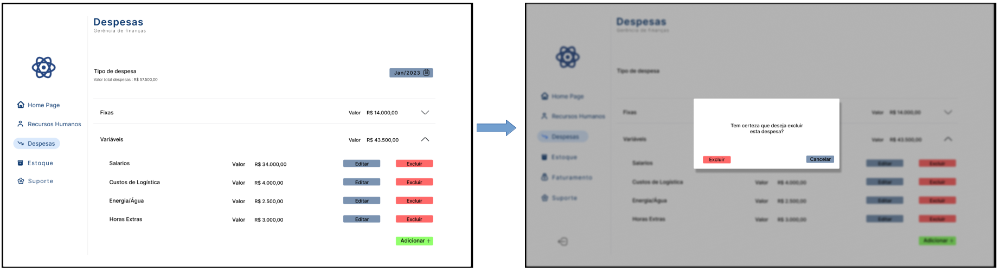

4 - Abaixo será ilustrado a tela de Estoque e seus fluxos:

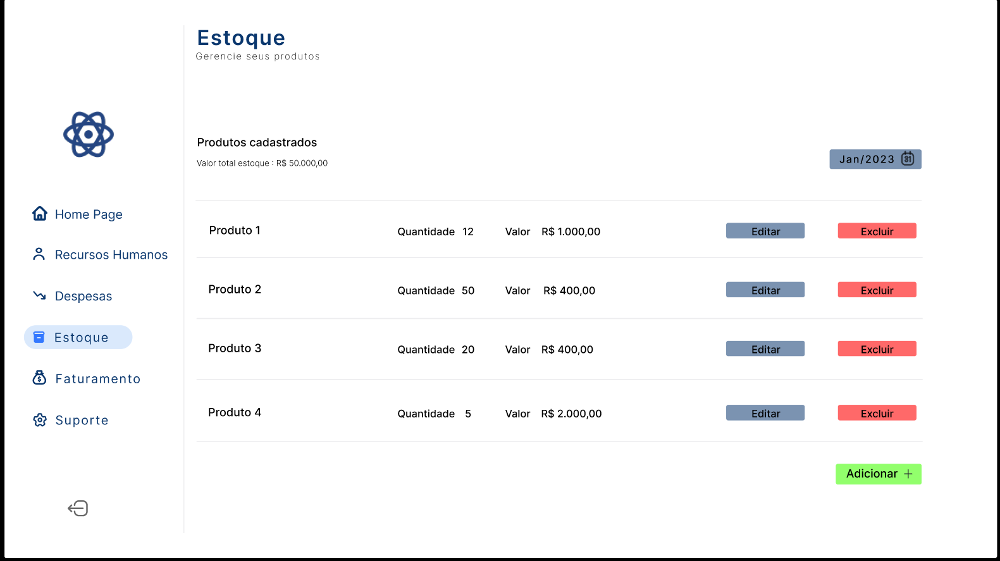

  4.1 - Fluxo de tela de adição de um novo produto:

  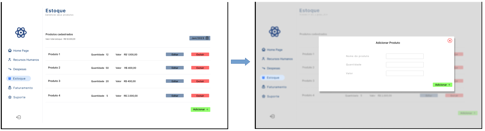

  4.2 - Fluxo de tela de edição de um produto:

  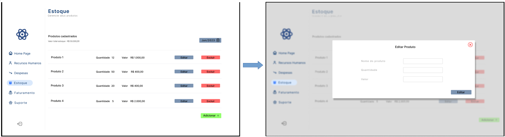

  4.3 - Fluxo de tela de remoção de um produto:

  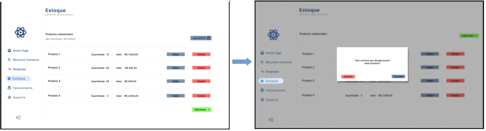

5 - Abaixo será ilustrado a tela de Faturamento e seus fluxos:

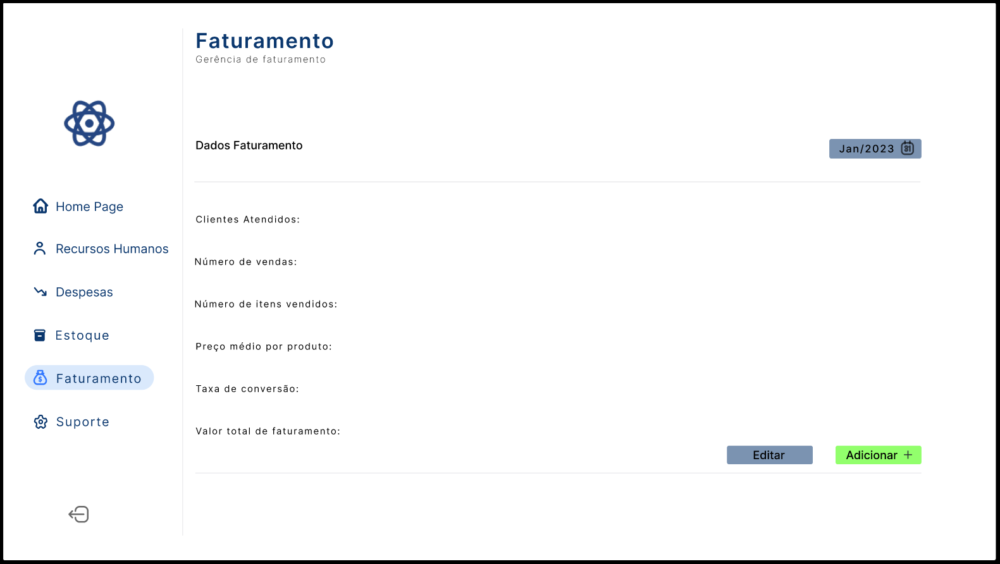

  5.1 - Fluxo de tela de adição de um novo faturamento:

  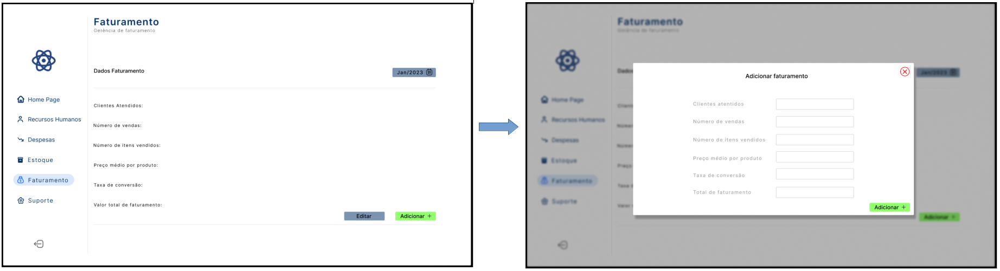

  5.2 - Fluxo de tela de edição de um faturamento:

  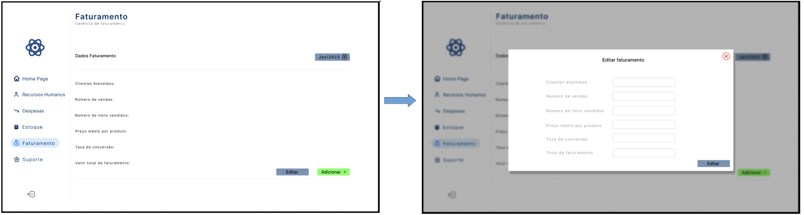

6 - Abaixo será ilustrado a tela de Suporte:

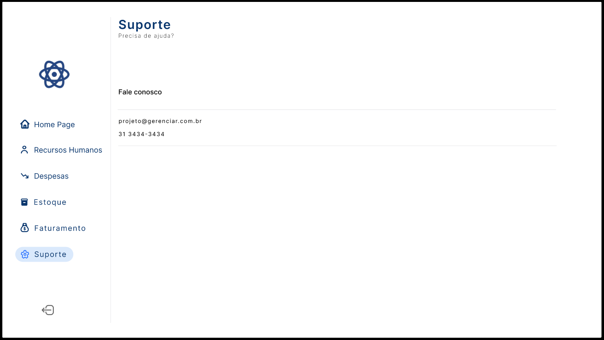

São protótipos usados em design de interface para sugerir a estrutura de um site web e seu relacionamentos entre suas páginas. Um wireframe web é uma ilustração semelhante do layout de elementos fundamentais na interface.
 
> **Links Úteis**:
> - [Protótipos vs Wireframes](https://www.nngroup.com/videos/prototypes-vs-wireframes-ux-projects/)
> - [Ferramentas de Wireframes](https://rockcontent.com/blog/wireframes/)
> - [MarvelApp](https://marvelapp.com/developers/documentation/tutorials/)
> - [Figma](https://www.figma.com/)
> - [Adobe XD](https://www.adobe.com/br/products/xd.html#scroll)
> - [Axure](https://www.axure.com/edu) (Licença Educacional)
> - [InvisionApp](https://www.invisionapp.com/) (Licença Educacional)
