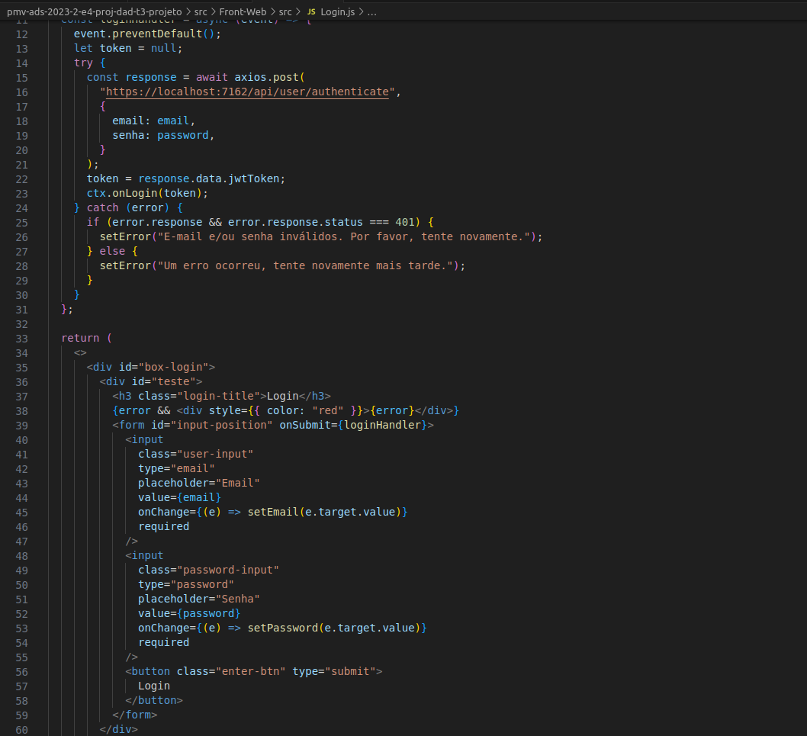

# Programação de Funcionalidades

Pré-requisitos: <a href="2-Especificação do Projeto.md"> Especificação do Projeto</a>, <a href="3-Projeto de Interface.md"> Projeto de Interface</a>, <a href="4-Metodologia.md"> Metodologia</a>, <a href="3-Projeto de Interface.md"> Projeto de Interface</a>, <a href="5-Arquitetura da Solução.md"> Arquitetura da Solução</a>

Abaixo será apresentada a implementação das funcionalidades de criação, edição e exclusão de dados, no sistema. Para demonstrar tal implementação será exposto o código fonte do backend de estoque, com os endpoints de criação, edição e exclusão de produtos.

Tal implementação seguiu a solicitação dos seguintes requisitos:

RF-02 - A aplicação deve permitir o usuário cadastrar novos dados.

RF-03 - A aplicação deve permitir o usuário realizar alterações nos dados cadastrados/preenchidos.

RF-04 - A aplicação deve permitir o usuário excluir dados das tabelas.

 
 
 

A seguir será apresentada a implementação das funcionalidades de login e autenticação no sistema. Para demonstrar tal implementação será exposto o código fonte do backend de login.

Tal implementação seguiu a solicitação dos seguintes requisitos:

RF-01	- A aplicação deve permitir o usuário acessar sua conta.

RNF-04 - A aplicação deve implementar autenticação baseada em tokens JWT (JSON Web Tokens) e autorização baseada em funções para garantir que apenas usuários autorizados tenham acesso a recursos específicos.

 
 

Implementação do sistema descritas por meio dos requisitos funcionais e/ou não funcionais. Deve relacionar os requisitos atendidos os artefatos criados (código fonte) além das estruturas de dados utilizadas e as instruções para acesso e verificação da implementação que deve estar funcional no ambiente de hospedagem.

Para cada requisito funcional, pode ser entregue um artefato desse tipo

> **Links Úteis**:
>
> - [Trabalhando com HTML5 Local Storage e JSON](https://www.devmedia.com.br/trabalhando-com-html5-local-storage-e-json/29045)
> - [JSON Tutorial](https://www.w3resource.com/JSON)
> - [JSON Data Set Sample](https://opensource.adobe.com/Spry/samples/data_region/JSONDataSetSample.html)
> - [JSON - Introduction (W3Schools)](https://www.w3schools.com/js/js_json_intro.asp)
> - [JSON Tutorial (TutorialsPoint)](https://www.tutorialspoint.com/json/index.htm)
