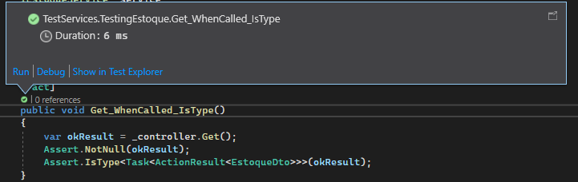

# Registro de Testes de Software

Pré-requisitos: <a href="3-Projeto de Interface.md"> Projeto de Interface</a>, <a href="8-Plano de Testes de Software.md"> Plano de Testes de Software</a>

Relatório com as evidências dos testes de software realizados no sistema pela equipe, baseado em um plano de testes pré-definido.

## Avaliação
Os testes foram executados com sucesso, validando a robustez e funcionalidade dos serviços. A equipe dedicou-se a garantir uma cobertura abrangente, resultando em um conjunto de testes confiável para a API. O GitHub Actions contribuiu para uma integração contínua eficiente.

## Testes Unitários

### Cenário de Teste 1:  Resultado do teste do Método `Get`
  
**Evidência:**

### Cenário de Teste 2: Resultado do teste do Método `Create`

**Evidência:**

### Cenário de Teste 3: Resultado do teste do Método `Delete` 
**Evidência:**

### Cenário de Teste 4: Resultado do teste do Método `Update` 

**Evidência:**

### Cenário de Teste 5: Resultado do teste do Método `GetByDate` 

**Evidência:**

### Cenário de Teste 6: Resultado do teste do Método `Get` 

**Evidência:**

### Cenário de Teste 7: Resultado do teste do Método `Create` 

**Evidência:**

### Cenário de Teste 8: Resultado do teste do Método `Delete` 

**Evidência:**

### Cenário de Teste 9 Resultado do teste do Método `Update` 

**Evidência:**

### Cenário de Teste 10: Resultado do teste do Método `GetByDate` 
**Evidência:**

# Testes de Integração com Swagger
## Objetivo

Realizar testes de integração utilizando o Swagger para verificar o correto funcionamento dos endpoints da API. Certifique-se de que os serviços associados aos endpoints estão corretamente implementados.

## Testes Realizados

### Cenário de Teste 1: Execução do Endpoint de Recuperação de Dados de Estoque

- **Endpoint Testado:** `GET /api/estoque`
   
**Evidência:**

### Cenário de Teste 2: Execução do Endpoint de Criação de Registro de Estoque

- **Endpoint Testado:** `POST /api/estoque`

**Evidência:**

### Cenário de Teste 3: Execução do Endpoint de Exclusão de Registro de Estoque

- **Endpoint Testado:** `DELETE /api/estoque/{id}`

**Evidência:**

### Cenário de Teste 4: Execução do Endpoint de Atualização de Registro de Estoque

- **Endpoint Testado:** `PUT /api/estoque/{id}`

**Evidência:**

### Cenário de Teste 5: Execução do Endpoint de Recuperação de Dados de Custo

- **Endpoint Testado:** `GET /api/custo`

**Evidência:**

### Cenário de Teste 6: Execução do Endpoint de Criação de Registro de Custo

- **Endpoint Testado:** `POST /api/custo`
  
**Evidência:**

### Cenário de Teste 7: Execução do Endpoint de Exclusão de Registro de Custo

- **Endpoint Testado:** `DELETE /api/custo/{id}`
   
**Evidência:**

### Cenário de Teste 8: Execução do Endpoint de Atualização de Registro de Custo

- **Endpoint Testado:** `PUT /api/custo/{id}`

**Evidência:**

### Cenário de Teste 9: Execução do Endpoint de Recuperação de Dados de Custo por Data

- **Endpoint Testado:** `GET /api/custo/data`

**Evidência:**

## Comentários e Avalições da equipe de desenvolvedores
- Eduardo: "investi tempo extra para entender a autenticação no Swagger, contribuindo para a integração perfeita."
- Alex: "dediquei esforços adicionais na integração dos testes de custo com o Swagger, resultando em uma solução eficiente."
- Fernando: "otimizei os testes unitários do estoque, investindo tempo para garantir uma cobertura abrangente."
- Erick: "superei desafios na configuração inicial do Swagger, destacando sua habilidade em resolver problemas."
- Mike: "refinei os testes de integração, investindo tempo na geração realista de dados para os testes de custo."
- Leticia: "aprimorei os testes de atualização do estoque, garantindo a sincronização eficiente com o banco de dados."

 

# Testes de Integração

## Objetivo

Realizar testes de integração utilizando o navegador e a aplicação mobile para verificar o correto funcionamento da aplicação. Certifique-se de que a aplicação está funcionando da maneira correta para os usuários.

## Resultados Obtidos dos Testes Realizados

 

## Função tela de dashboard

### Cenário 1: Verificar a exibição inicial do Dashboard

O teste foi realizado com sucesso tanto na Web quanto no Mobile.

**Evidências:**

Tela Web

Tela Mobile

 

### Cenário 2: Atualizar dados após mudança de data

O teste foi realizado com sucesso tanto na Web quanto no Mobile.

**Evidências:**

https://github.com/ICEI-PUC-Minas-PMV-ADS/pmv-ads-2023-2-e4-proj-dad-t3-projeto/assets/90225435/0988abfe-7aac-4a43-91a0-b7d2ae84e0d0

Tela Web

https://github.com/ICEI-PUC-Minas-PMV-ADS/pmv-ads-2023-2-e4-proj-dad-t3-projeto/assets/90225435/f80948f8-f7cf-48d1-bfb6-b8b42d4de1d0

Tela Mobile

 

### Cenário 3: Verificar a resposta para grandes volumes de dados

O teste foi realizado com sucesso tanto na Web quanto no Mobile.

**Evidências:**

https://github.com/ICEI-PUC-Minas-PMV-ADS/pmv-ads-2023-2-e4-proj-dad-t3-projeto/assets/90225435/4cfbd1db-e824-4e82-8951-93e1be3a143e

Tela Web

https://github.com/ICEI-PUC-Minas-PMV-ADS/pmv-ads-2023-2-e4-proj-dad-t3-projeto/assets/90225435/10a00ccd-afba-460f-8704-f82e6ee82d40

Tela Mobile

 

### Cenário 4: Resposta da aplicação a uma mudança rápida de datas

O teste foi realizado com sucesso tanto na Web quanto no Mobile.

**Evidências:**

https://github.com/ICEI-PUC-Minas-PMV-ADS/pmv-ads-2023-2-e4-proj-dad-t3-projeto/assets/90225435/3d5d881b-7dd7-4e8b-8b42-e008fd65f44c

Tela Web

https://github.com/ICEI-PUC-Minas-PMV-ADS/pmv-ads-2023-2-e4-proj-dad-t3-projeto/assets/90225435/320020b4-6fcb-4bc0-bb4a-b3dc70a58d27

Tela Mobile

